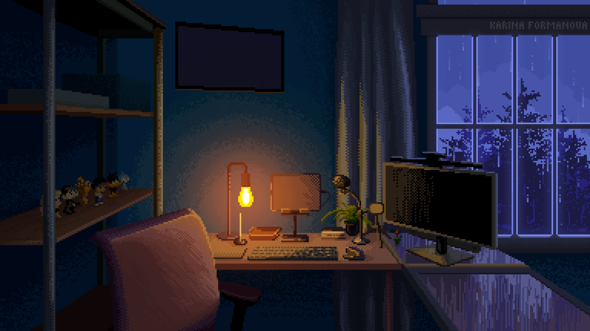

  <h1>Hey, I'm Gabriel Maia</h1>

| English | [Português](README_PT.md) |

  <a target="_blank" href="https://www.linkedin.com/in/gabriel-maia-gondim-0a7646169/"></img></a>
  <a target="_blank" href="mailto:gammag362@gmail.com"></img></a>

  <!-- <a target="_blank" href="#"></img></a>
  <a target="_blank" href="#"></img></a>
  <a target="_blank" href="https://github.com/gammag4/"></img></a>
  <a target="_blank" href="#"></img></a>

  <a target="_blank" href="#"></img></a>
  <a target="_blank" href="#"></img></a>

  <a target="_blank" href="#"></img></a>
  <a target="_blank" href="#"></img></a>
  <a target="_blank" href="#"></img></a>
  <a target="_blank" href="#"></img></a>
  <a target="_blank" href="#"></img></a> -->

---

<!--  -->

*3D Novel View Synthesis renderer*
 
  

<!--  -->

- 👨🏽‍💻 I am a developer specialized in Neural Networks, Computer Vision and Image/Video Processing with strong foundations in math, algorithms and engineering, and a professional learner
- 🔍 I am currently looking for job opportunities
<!-- - 📚 I like math, circuits, robots, piano, phylosophy, legos, exploration/procedural games and other stuff -->
<!-- - 💻 Full-stack developer with experience across web, mobile and embedded systems -->

<!-- Full list with my skills and capabilities [here](Skills.md). -->

### Tech Stack

**ML & Computer Vision:** PyTorch, OpenCV, Scikit-Learn, DLib, NumPy, Pandas, FFmpeg

**Languages:** Python, Rust, C/C++, Java, Julia, Haskell, MATLAB

**Web:** React, Next.js, Express, Django, Spring Boot, ASP.NET Core

**Mobile:** Android (Kotlin), Flutter

**Other:** CUDA, OpenGL, Docker, Git, Linux, Arduino, 3D/2D GameDev, Procedural Generation

### Knowledge

- **Neural Networks:** Transformers, CNNs, RNNs, LSTM, Autoencoders, ResNets, NeRF, LVSM
- **Computer Vision:** 3D rendering, 3D novel view synthesis, object/face/gesture detection, facial recognition, OCR, image classification
- **Image Processing:** Spatial/spectral filtering, histogram analysis, feature extraction, wavelets
- **Machine Learning:** Regression, classification, clustering, dimensionality reduction, ensemble methods, simulated annealing
- **Math:** Linear algebra, calculus, probability & statistics, differential equations, signals & systems
- **Software Engineering:** Agile (XP, Scrum, Kanban), SOLID, Clean, REST APIs, unit testing
<!--
## Estudando Atualmente

- Control Theory, with focus on state-space representation of linearized systems;
- Álgebra moderna/abstrata (lendo [Vinberg - A Course in Algebra](https://www.amazon.com/Course-Algebra-B-Vinberg/dp/0821834134));
- Topologia (lendo [Munkres - Topology](https://www.amazon.com/Topology-2nd-James-Munkres/dp/0131816292));
- Análise (lendo [Rudin - Principles of Mathematical Analysis](https://www.amazon.com/Principles-Mathematical-Analysis-International-Mathematics/dp/007054235X)). -->

<!-- 

  <strong>
    <i>
      "Faça as perguntas corretas, e você terá as respostas que precisa. Faça as perguntas erradas, e você será consumido por mentiras confortantes."
    </i>
  <strong>

 -->

---

  
  

<!-- |||
|:---:|:---:|
|  | a ...   Usei uma imagem docker separada, que está [aqui](https://github.com/gammag4/nn-image) |
|  | a |
|  | a |
|  | a |
|  | a |
|  | a |
|  | a | -->

<!-- 

  
  

  
  

  
  

  
  

 -->

<!-- |||
|:---:|:---:|
|  |  |

|||
|:---:|:---:|
|  |  |
|  |  |
|  |  |
|  |  | -->
